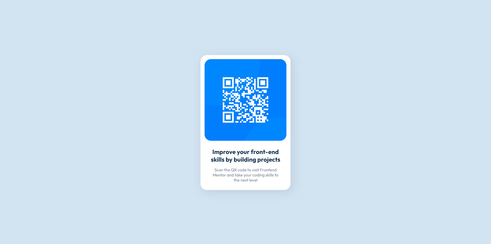

# Frontend Mentor - QR code component solution

This is a solution to the [QR code component challenge on Frontend Mentor](https://www.frontendmentor.io/challenges/qr-code-component-iux_sIO_H).

## Table of contents

- [Overview](#overview)
  - [Screenshot](#screenshot)
  - [Links](#links)
- [Author](#author)

## Overview

### Screenshot

### Links

- Solution URL: [Github](https://github.com/gatecol/QR-Code-Component)
- Live Site URL: [Github Pages](https://gatecol.github.io/QR-Code-Component)

## Author

- Website - [Github](https://github.com/gatecol)
- Frontend Mentor - [@gatecol](https://www.frontendmentor.io/profile/gatecol)